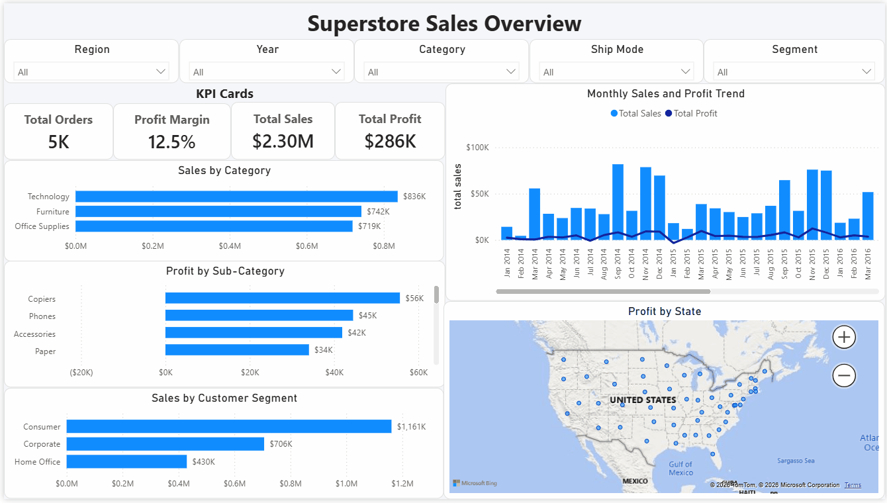
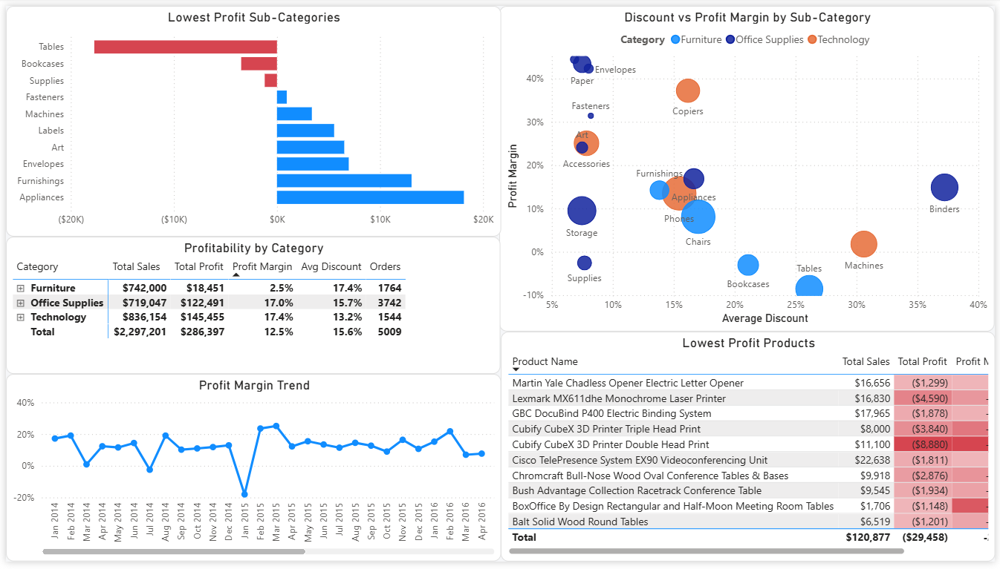
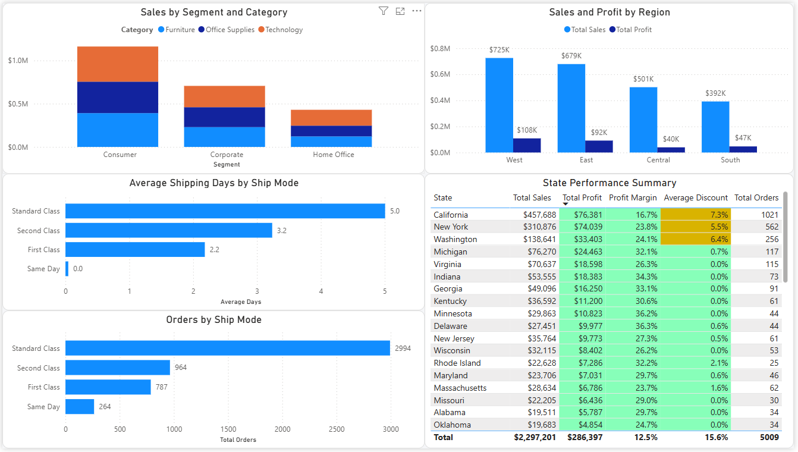

# Superstore Sales Performance Dashboard w/ Power BI

## Introduction

This dashboard was created to analyse retail sales performance, profitability, discount impact, and regional business trends using the **Sample Superstore dataset**.

The project builds on my previous Excel dashboard, which used PivotTables, formulas, charts, and data validation to explore sales and profit performance. This Power BI version uses the same dataset as the Excel project, but recreates the analysis with a more professional business intelligence workflow, allowing users to interact with the report through slicers, drill-through pages, dynamic KPI cards, maps, and conditional formatting.

The aim of this project is to show how the same business problem can be approached across different visualisation tools. While the Excel version focused on spreadsheet-based analysis, this Power BI version provides a more scalable and interactive dashboard experience.

### Dashboard File

You can find the file for the dashboard here: [`Superstore_Dashboard.pbix`](Superstore_Dashboard_BI.pbix).

## Skills Showcased

This project demonstrates key Power BI features used to transform raw retail data into an interactive business dashboard.

- **⚙️ Data Transformation with Power Query:** Cleaned and prepared the Superstore dataset by checking data types, formatting date fields, and creating additional columns for analysis, including shipping duration.

- **📅 Date Formatting and Data Cleaning:** Converted `Order Date` and `Ship Date` from US date format to UK date format using locale settings. This avoided parsing errors caused by the original `mm/dd/yyyy` format and allowed dates to display correctly as `dd/mm/yyyy`.

- **🔗 Data Modelling:** Created a dedicated Date Table and connected it to the main Superstore table using `Order Date`, allowing proper time-based analysis across sales, profit, and margin trends.

- **🧮 DAX Measures:** Created key measures such as `Total Sales`, `Total Profit`, `Profit Margin`, `Average Discount`, `Total Orders`, `Sales per Order`, and `Average Shipping Days`.

- **🔢 Custom KPI Formatting:** Built custom DAX-formatted KPI measures to control how values display on cards. This solved an issue where Power BI automatically changed display units under slicer selections. For example, Total Sales can display as `$2.30M` at full scale and `$300K` when filtered, instead of showing values such as `$300.71K`.

- **📊 Core Visualisations:** Used bar charts, line charts, scatter charts, maps, matrix tables, and KPI cards to analyse sales, profit, discounts, products, regions, and customer segments.

- **🗺️ Geospatial Analysis:** Used map visuals to show sales and profit performance across states and regions.

- **🎨 Conditional Formatting:** Applied conditional formatting across KPI cards, matrix tables, and profitability visuals to make key business risks easier to identify. Negative profit values, high discount areas, weak profit margins, and strong-performing categories were visually highlighted to support faster interpretation.

- **🖱️ Interactive Reporting:**
    - **Slicers:** Used to filter the report by year, region, category, segment, and shipping mode.
    - **Tooltips:** Added extra context to visuals, including sales, profit, margin, discount, and order values.
    - **Drill-Through:** Created a detailed page to allow deeper analysis from a high-level view.
    - **Navigation Buttons:** Used page navigation to create a smoother dashboard experience.

---

## Dataset

The dashboard uses the **Sample Superstore dataset**, which contains retail order data including:

- Product categories and sub-categories
- Sales and profit values
- Discount levels
- Order dates and shipping dates
- Customer segments
- Shipping modes
- States and regions

This is the same dataset used in my Excel dashboard project. Although the dataset was downloaded again from the same Kaggle provider, the year values appear to have shifted forward by a few years compared with my original Excel version. However, the overall patterns and insights remain consistent with the Excel project.

---

## Dashboard Overview

*This report is split into three main pages to provide a clear flow from high-level business performance to deeper profitability and regional analysis.*

### Page 1: Sales Overview

This page provides a high-level summary of overall business performance. It includes key KPI cards such as **Total Sales**, **Total Profit**, **Profit Margin**, **Average Discount**, and **Total Orders**.

The page also includes visuals for monthly sales and profit trends, sales by category, profit by sub-category, sales by customer segment, and profit by state. This gives users a quick understanding of overall business health and highlights where sales and profit performance may differ.

### Page 2: Profitability Analysis

This page focuses on the relationship between discounting and profitability.

A scatter chart was used to compare **Average Discount** against **Profit Margin**, with each point representing a product sub-category. The size of each point reflects total sales, while the colour represents product category. This makes it easier to identify sub-categories that generate strong sales but weak margins.

Additional visuals, including matrix tables and bottom-performing product views, were used to highlight loss-making areas, high discount patterns, and sub-categories that may need closer business attention.

### Page 3: Regional Performance

This page explores performance across regions, states, customer segments, and shipping modes.

The page includes regional sales and profit comparisons, state-level performance summaries, shipping mode analysis, and customer segment breakdowns. This helps identify which geographic areas and customer groups contribute most to sales and profit, as well as where operational or margin issues may exist.

---

## Key Insights

- High sales do not always lead to high profit. Some sub-categories generate strong revenue but weaker profit margins.
- Discounting has a clear impact on profitability, especially where higher average discounts are linked with lower profit margins.
- Certain sub-categories and products contribute negatively to overall profit, making them important areas for further review.
- Regional performance varies across states, showing that location plays an important role in sales and profit outcomes.
- Customer segment and shipping mode analysis adds another layer of business context beyond simple sales reporting.

---

## Conclusion

This dashboard shows how Power BI can transform a spreadsheet-based sales analysis into a more interactive and professional business intelligence report.

By rebuilding my Excel Superstore project in Power BI, I was able to demonstrate a wider range of data visualisation skills, including Power Query transformation, data modelling, DAX measures, custom KPI formatting, conditional formatting, map visuals, slicers, tooltips, and drill-through functionality.

The project highlights how the same dataset can be used across different tools to produce deeper insights, clearer storytelling, and a more scalable reporting experience.
